# Windows Endpoint Configuration & Troubleshooting Lab

## Project Overview

This repository documents Windows endpoint configuration and troubleshooting tasks completed on a Windows 10 Pro client machine.

The purpose of this lab is to practise common IT Support and Service Desk tasks, including checking system information, confirming domain membership, creating local user accounts, managing local administrator permissions, reviewing Windows Update, checking Device Manager, reviewing Event Viewer logs, checking Windows services, reviewing disk management, and running basic Windows maintenance commands.

## Lab Environment

| Component | Details |
|---|---|
| Virtualisation | Oracle VirtualBox |
| Client OS | Windows 10 Pro |
| Client Name | WIN10-CLIENT |
| Domain | shirleylab.local |
| Domain User Used | shirleylab\hr.user1 |
| Tools Used | Computer Management, System Information, System Properties, PowerShell, Windows Update, Device Manager, Event Viewer, Services, Disk Management, Task Manager, Disk Cleanup, Command Prompt |

## Completed Labs

| Lab | Topic | Status |
|---|---|---|
| Lab 01 | Endpoint Baseline & Local User Management | Complete |
| Lab 02 | Windows Update, Device Manager, Event Viewer & Services | Complete |
| Lab 03 | Disk Management & Basic Windows Maintenance | Complete |

## Lab Notes

- [Lab 01 — Endpoint Baseline & Local User Management](notes/lab-01-endpoint-baseline.md)
- [Lab 02 — Windows Update, Device Manager, Event Viewer & Services](notes/lab-02-windows-troubleshooting.md)
- [Lab 03 — Disk Management & Basic Windows Maintenance](notes/lab-03-disk-management-maintenance.md)

## Troubleshooting Scenarios

- [Scenario 01 — Standard User Permission Limitation](troubleshooting-scenarios/scenario-01-standard-user-permissions.md)
- [Scenario 02 — Device Manager Administrator Permission Warning](troubleshooting-scenarios/scenario-02-device-manager-permissions.md)
- [Scenario 03 — Disk Management Access Rights Warning](troubleshooting-scenarios/scenario-03-disk-management-access-rights.md)
- [Scenario 04 — System File Checker Repaired Corrupt Files](troubleshooting-scenarios/scenario-04-sfc-corrupt-files-repaired.md)

## Lab 01: Endpoint Baseline & Local User Management

### System Information

Checked the Windows endpoint system information using `msinfo32`.


### Computer Name and Domain Membership

Confirmed that the Windows 10 client was joined to the `shirleylab.local` domain.


### Local Administrator Group Membership

Created a local administrator account and added it to the local Administrators group.


### Local Users Created

Created local standard and local administrator accounts for endpoint support practice.


### Command-Line Verification

Verified the logged-in domain user, hostname, local users, and local Administrators group membership using PowerShell commands.


## Lab 02: Windows Update, Device Manager, Event Viewer & Services

### Windows Update Status

Checked Windows Update settings on the Windows 10 endpoint.

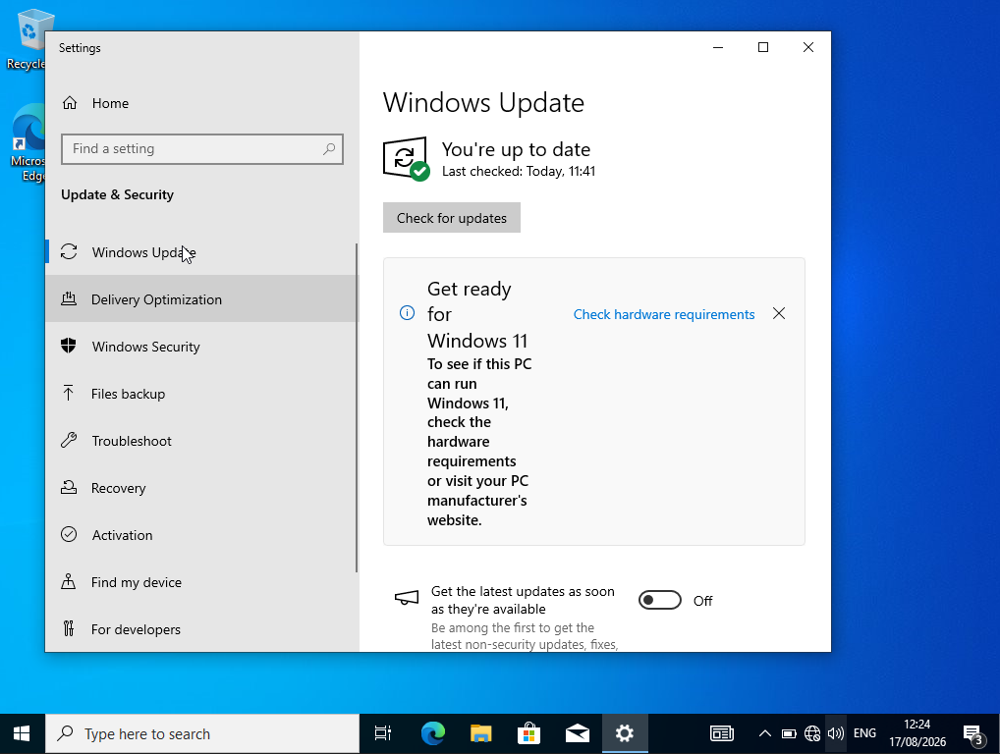

### Device Manager Standard User Warning

Confirmed that a standard domain user can view some device settings but needs administrator credentials to make device-level changes.

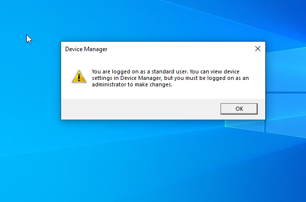

### Device Manager Admin View

Opened Device Manager with administrator permissions to review endpoint hardware and device status.

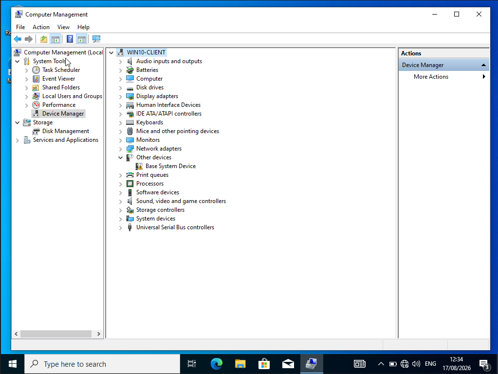

### Event Viewer System Logs

Checked Windows System logs in Event Viewer.

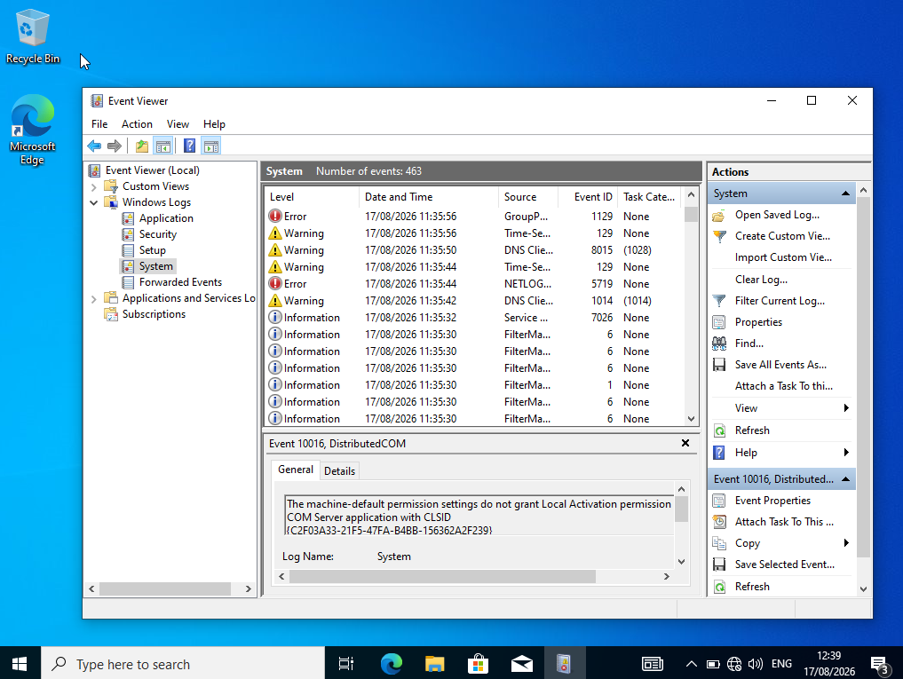

### Event Viewer Application Logs

Checked Windows Application logs in Event Viewer.

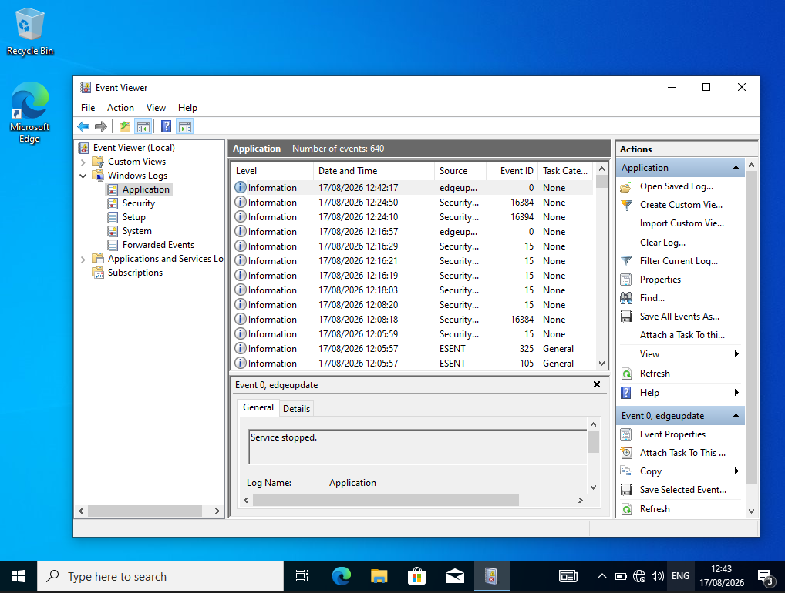

### Services Console

Opened the Services console to review Windows services and their startup status.

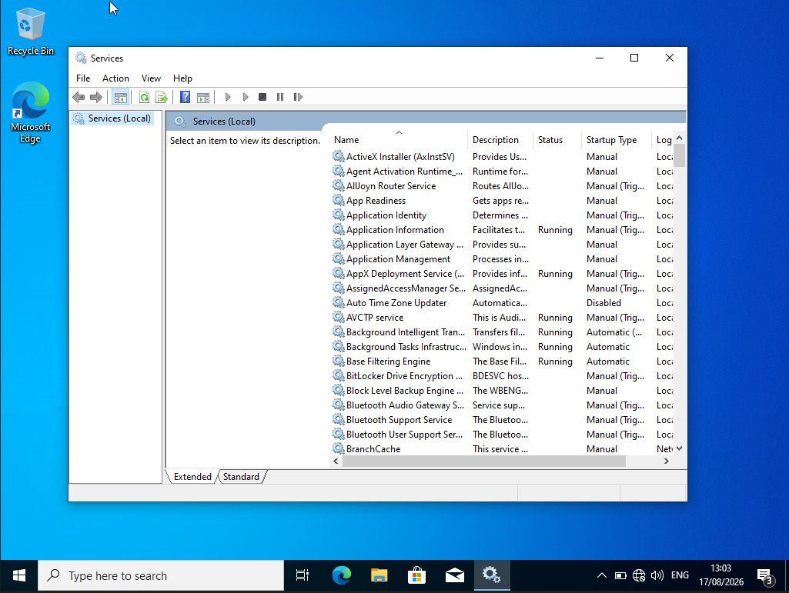

## Lab 03: Disk Management & Basic Windows Maintenance

### Disk Management Standard User Warning

Opened Disk Management as a standard domain user and observed that administrator permissions were required.

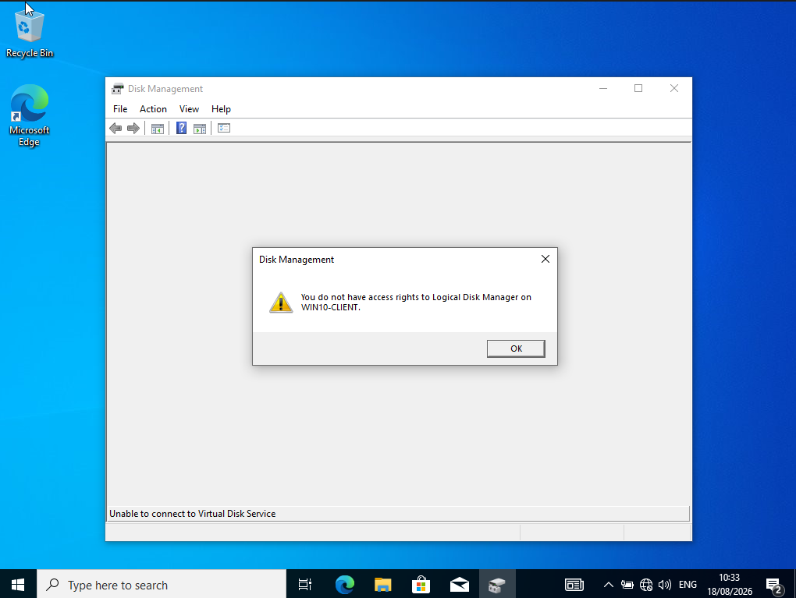

### Disk Management Overview

Opened Disk Management with administrator permissions to review the disk layout, partitions, and C: drive status.

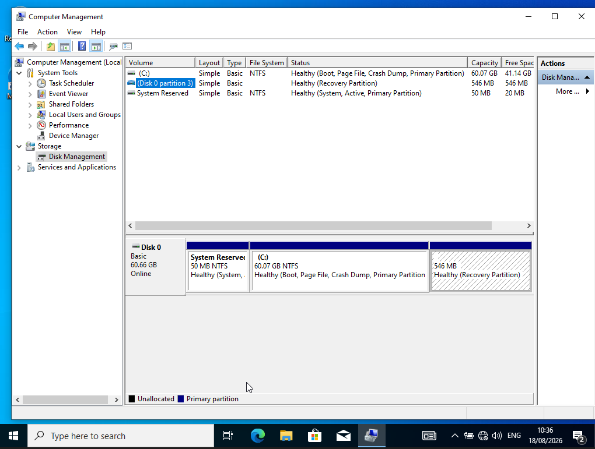

### Storage Settings

Checked Windows Storage settings to review endpoint storage usage.

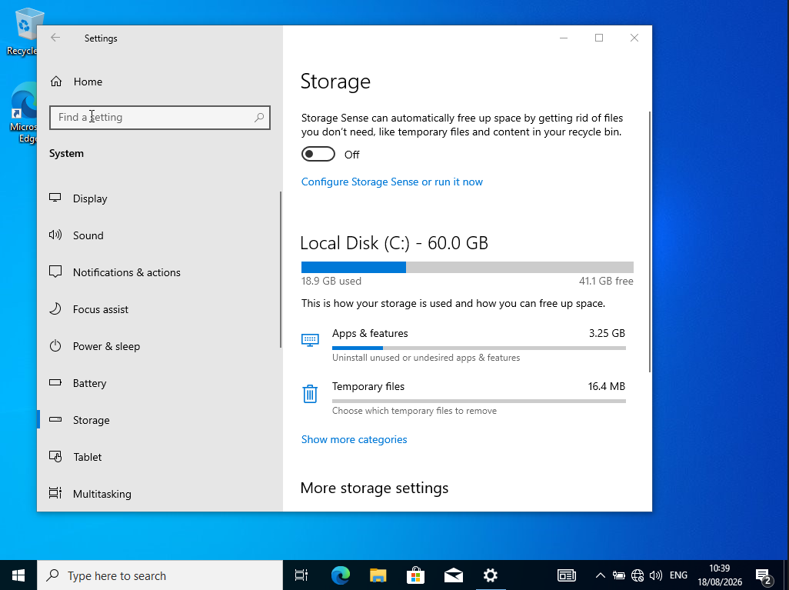

### Task Manager Startup Apps

Opened Task Manager to review startup applications.

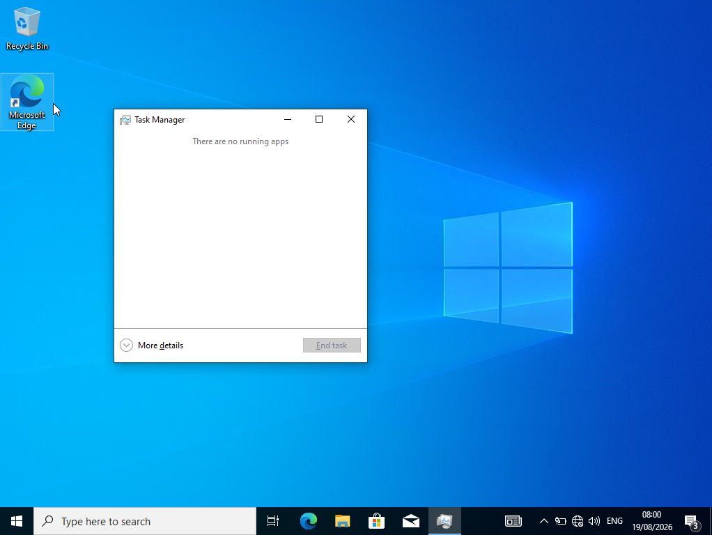

### Disk Cleanup

Opened Disk Cleanup to review temporary files and possible storage cleanup options.

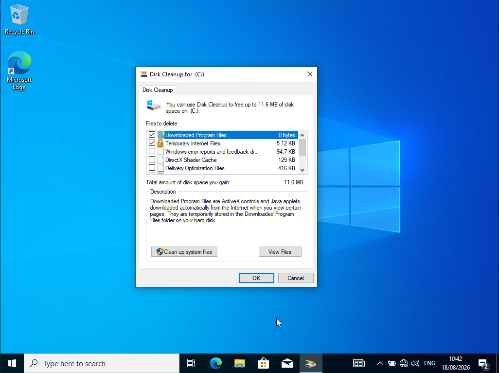

### System File Checker Scan

Ran `sfc /scannow` from an administrator Command Prompt to check and repair Windows system files.

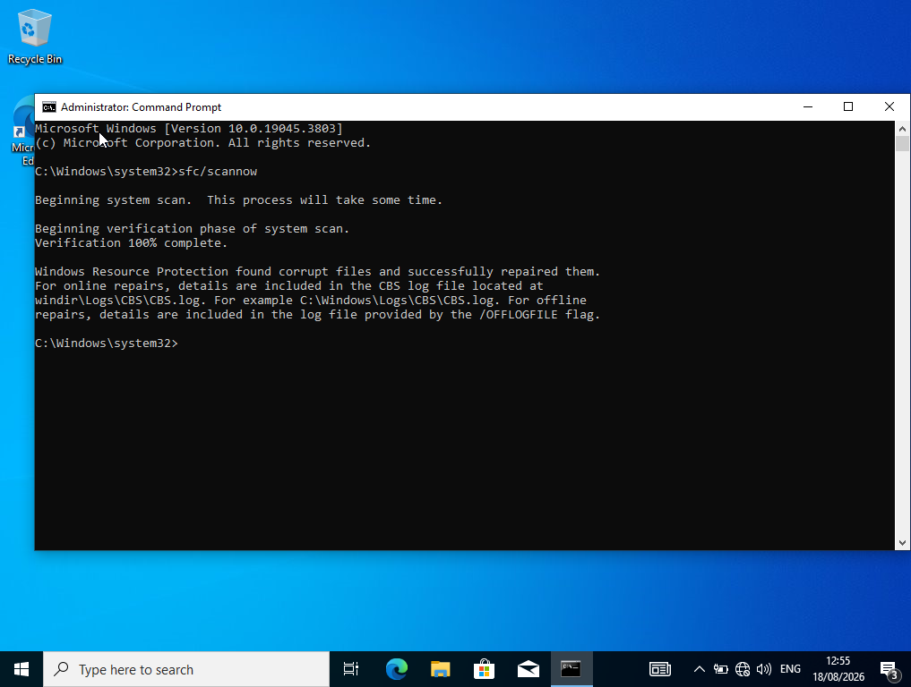

### Check Disk Scan

Ran `chkdsk C:` to check the file system and disk status.

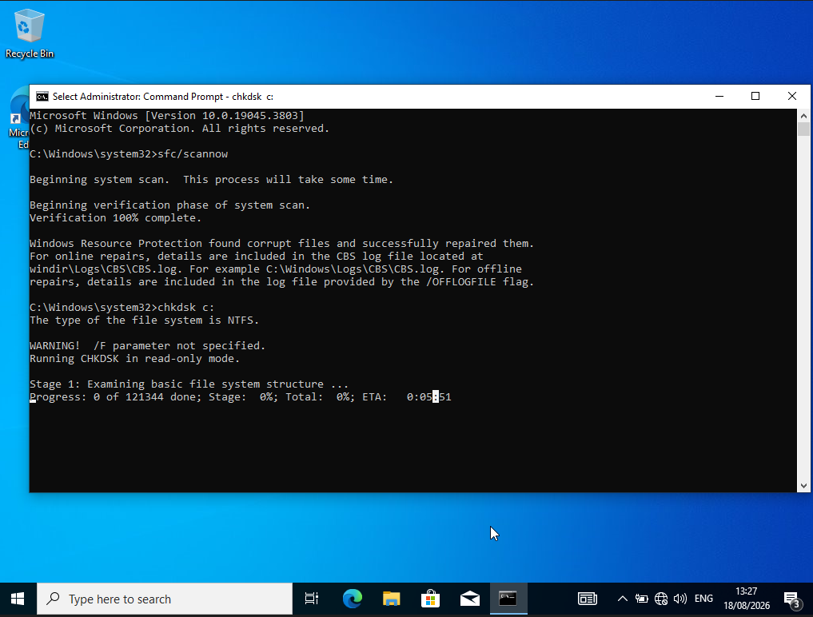

## Skills Practised

- Windows endpoint configuration
- Windows 10 support
- Local user account creation
- Local administrator management
- Domain membership verification
- Computer Management
- System Properties
- System Information
- PowerShell verification commands
- User Account Control awareness
- Windows Update checks
- Device Manager review
- Event Viewer log review
- Services console review
- Standard user vs administrator permissions
- Disk Management review
- Storage usage checks
- Task Manager startup review
- Disk Cleanup checks
- System File Checker scan
- Check Disk scan
- Basic Windows maintenance
- Technical documentation

## Commands Used

```powershell
whoami
hostname
net user
net localgroup administrators
sfc /scannow
chkdsk C:
