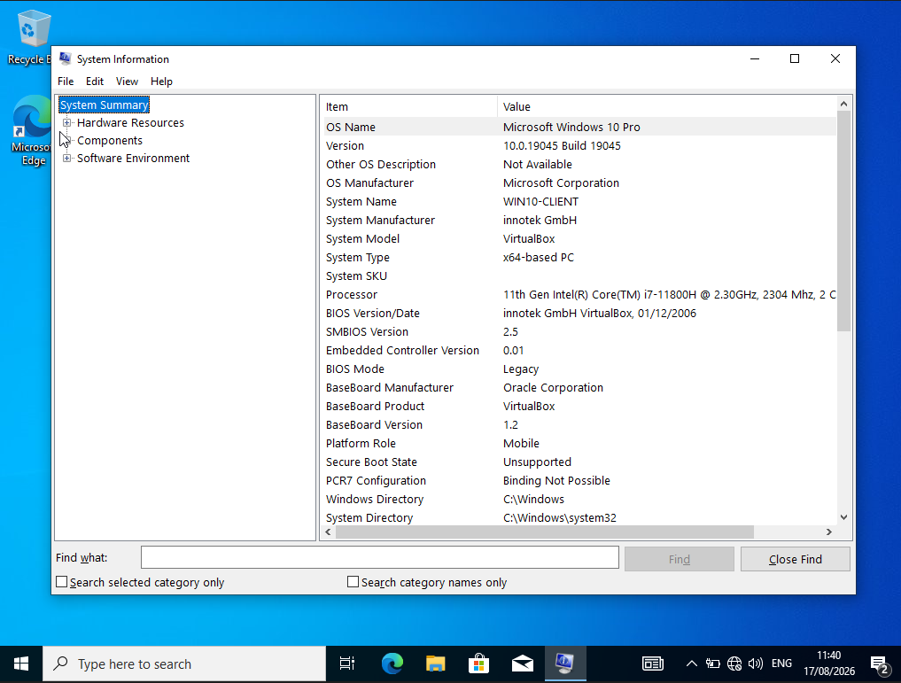
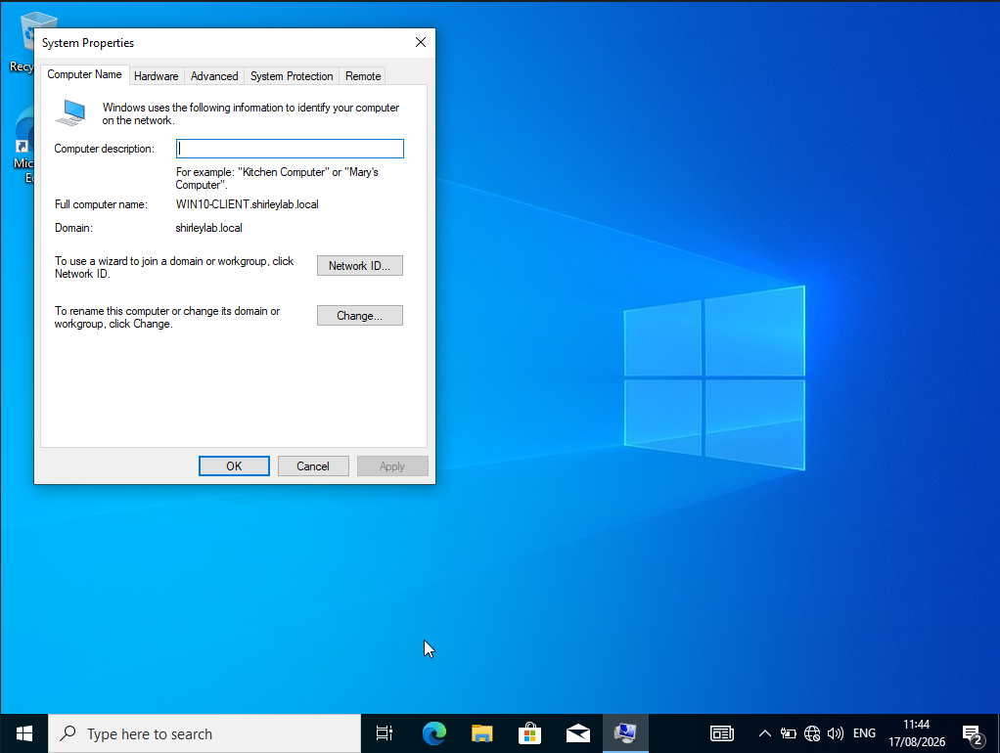
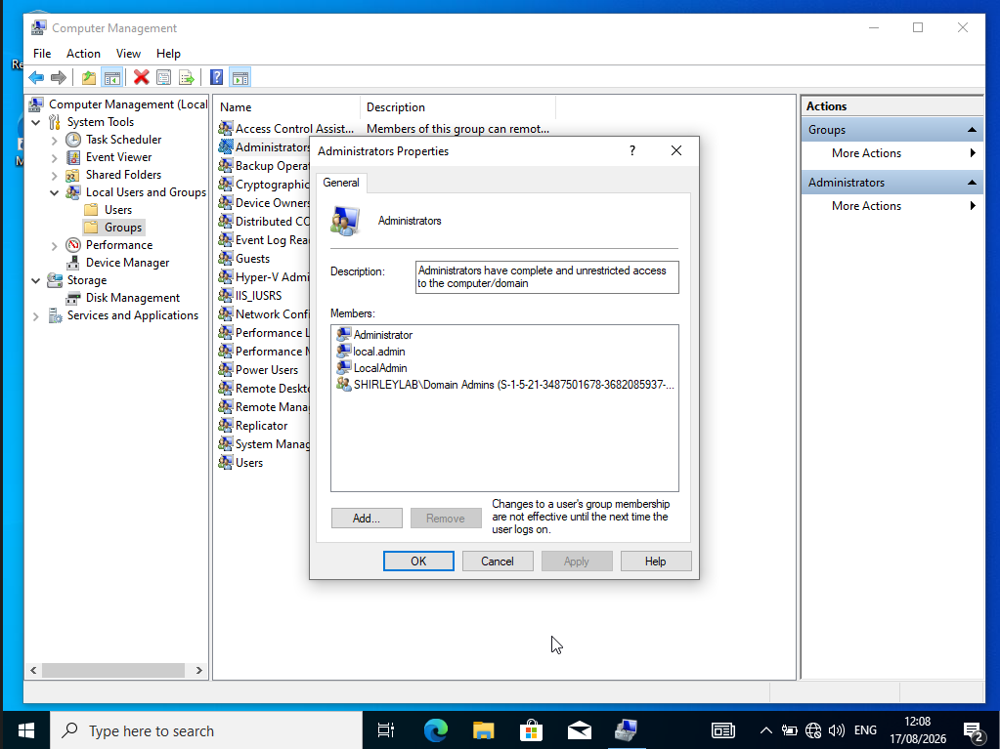
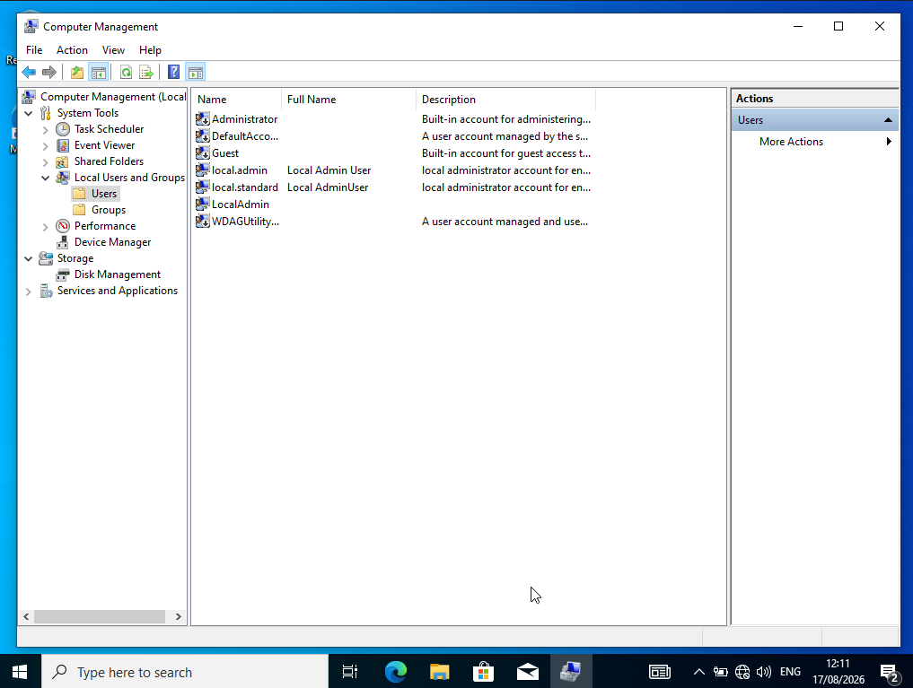
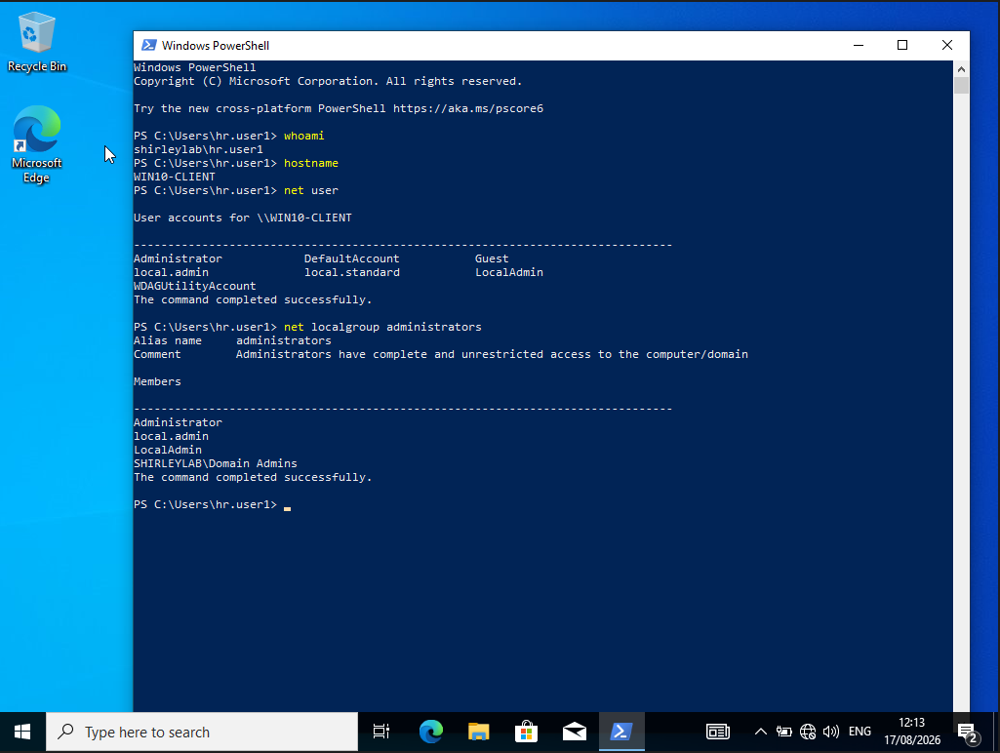

# Windows Endpoint Configuration & Troubleshooting Lab

## Project Overview

This repository documents Windows endpoint configuration and troubleshooting tasks completed on a Windows 10 Pro client machine.

The purpose of this lab is to practise common IT Support and Service Desk tasks, including checking system information, confirming domain membership, creating local user accounts, managing local administrator permissions, and verifying user/group configuration from the command line.

## Lab Environment

| Component | Details |
|---|---|
| Virtualisation | Oracle VirtualBox |
| Client OS | Windows 10 Pro |
| Client Name | WIN10-CLIENT |
| Domain | shirleylab.local |
| Domain User Used | shirleylab\hr.user1 |
| Tools Used | Computer Management, System Information, System Properties, PowerShell |

## Completed Labs

| Lab | Topic | Status |
|---|---|---|
| Lab 01 | Endpoint Baseline & Local User Management | Complete |

## Lab 01: Endpoint Baseline & Local User Management

### System Information

Checked the Windows endpoint system information using `msinfo32`.



### Computer Name and Domain Membership

Confirmed that the Windows 10 client was joined to the `shirleylab.local` domain.



### Local Administrator Group Membership

Created a local administrator account and added it to the local Administrators group.



### Local Users Created

Created local standard and local administrator accounts for endpoint support practice.



### Command-Line Verification

Verified the logged-in domain user, hostname, local users, and local Administrators group membership using PowerShell commands.



## Skills Practised

- Windows endpoint configuration
- Windows 10 support
- Local user account creation
- Local administrator management
- Domain membership verification
- Computer Management
- System Properties
- System Information
- PowerShell verification commands
- User Account Control awareness
- Technical documentation

## What I Learned

This lab helped me understand how IT Support technicians check and manage a Windows endpoint in a domain environment.

I learned how to confirm system information, check the computer name and domain membership, create local user accounts, and manage local administrator permissions.

I also practised using User Account Control, running tools with administrator credentials, and verifying endpoint configuration using PowerShell commands such as `whoami`, `hostname`, `net user`, and `net localgroup administrators`.

This helped me understand the difference between a domain user, a local user, and a local administrator account on a Windows client machine.

## Commands Used

```powershell
whoami
hostname
net user
net localgroup administrators
